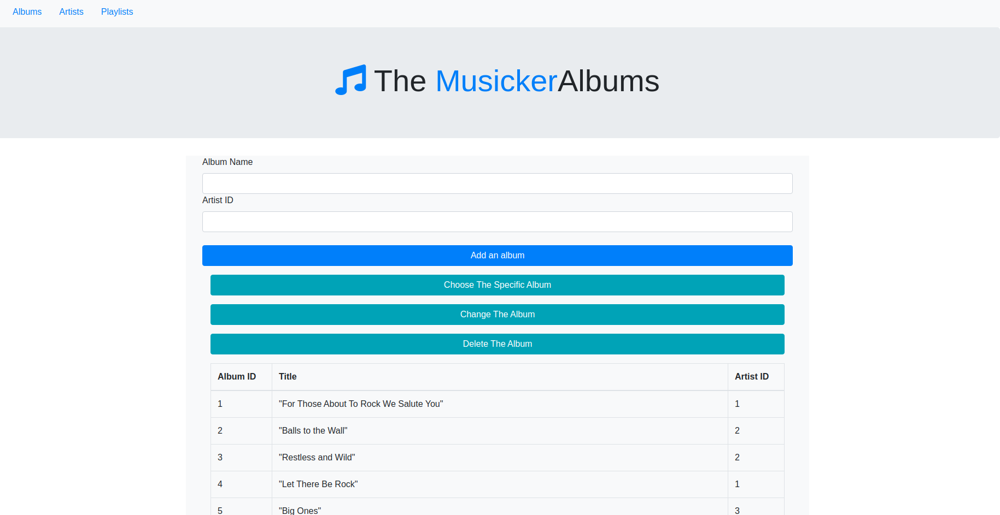
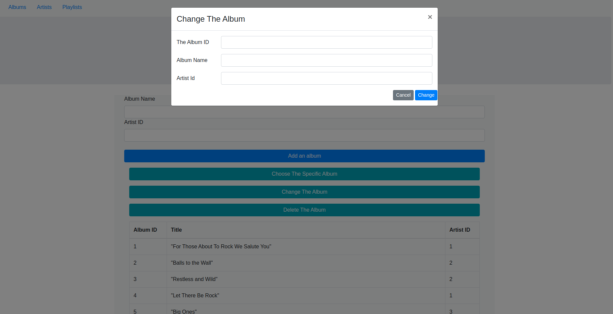

# the-musicker
node full stack

A static web page for rhythmic expression built with HTML, CSS, JavaScript & Node.

It looks something like this:

---

## Notes

Studying this project I learned about:

- Node
- Working with `sqlite` data(getAll, getOne, create, update, delete)
- Making full stack project

This resource was very helpful:

SQLite starts: https://www.youtube.com/watch?v=2PCaD0Y4MP4&list=PLzV58Zm8FuBIWu1zvGRUfn0Xh6HXRg9cG&index=7

This app can be used to see the tables of `chinook queries`.

I wrote an API that allows users to create, update, and delete rows in `sqlite table`.
  
At the end I prepared frontend of this app with using `form action and method`. Also I used `bootstrap modal` to prepare update, delete, read one row of tables.
